# Collision Detection

At this point you should be familiar with functions, animations, and `if` statements. This tutorial introduces **collision detection**, which allows you to determine when two shapes touch. If you can determine that two shapes touch, you can trigger some action- think of detecting when the user has moused over a button, or when a game character touches the floor or a badguy, or when your animation reaches a certain state.

Collision detection can be accomplished using code that ranges from simple `if` statements to complicated algorithms handling thousands of objects at once, and even libraries that simulate realistic physics. We'll start with something simple and work our way up from there.

## Edge Collision Detection

Remember this program from the animation tutorial, which displays a ball bouncing around the screen?  We first initialized a circle with the following values:
```python
# Create the the size, position, speed and color for a circle
circlePos  = [200,200]  #[x,y] position
circleSize = 30         #Radius of the circle
circleColor = (255,0,0) #Color of the circle
circleSpeed = [1,2.5]   #Speed in the x and y directions
```

We can then animate the ball and make it bounce with the following code:
```python
circlePos[0] += circleSpeed[0]
circlePos[1] += circleSpeed[1]

if circlePos[0] >= surfaceSize:  #Right Side
    circleSpeed[0] = circleSpeed[0]*-1
elif circlePos[0] <= 0:          #Left Side
    circleSpeed[0] = circleSpeed[0]*-1

if circlePos[1] >= surfaceSize:  #Top Side
    circleSpeed[1] = circleSpeed[1]*-1
elif circlePos[1] <= 0:          #Bottom Side
    circleSpeed[1] = circleSpeed[1]*-1

```
This code creates variables that store the position and speed of the ball. It uses those variables to draw the ball, and then it adjusts the position of the ball by its speed. Finally, it checks whether the ball has gone off the left or right sides of the window, and if so it reverses the `xSpeed` of the ball. Similarly, it then checks whether the ball has gone off the top or bottom of the window, and if so it reverses the `ySpeed` of the ball. In other words, it detects whether the ball has collided with the edges of the screen, and if so it tells the ball to bounce off the edge it collided with!

This might seem simplistic, but this is a basic form of collision detection: the **state** of an object (in this case, the ball's position and speed) is stored in a set of variables, those variables are used to check whether the object collides with another (in this case, the edges of the screen), and if so, some action is taken (the speed variables are reversed to cause the ball to bounce). Bouncing the ball is just an example, but you can do anything you want. You could teleport the ball to the other side of the window so it wraps (like Pac-Man), or you could move to the next screen (like Zelda), or you could end the game (like Pong).

Every other form of collision detection will follow those basic steps. The only thing that changes is the particulars of how those steps are implemented.

Also note that you can use this form of collision detection with any edge, not just the edges of the window. Just change the numbers in the `if` statements to change where the edges are!

## Circle Point Collision

If you have a center of a circle (as an `x,y` coordinate), the radius of that circle (in pixels) and another point (another `x,y` coordinate), how do you know whether the second point is inside the circle?

In other words, how do you know that this point is outside the circle:

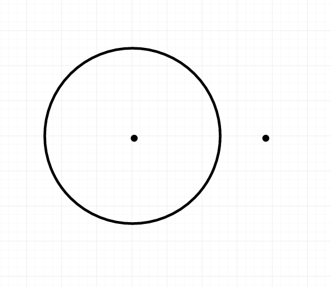

But that this point is inside the circle:

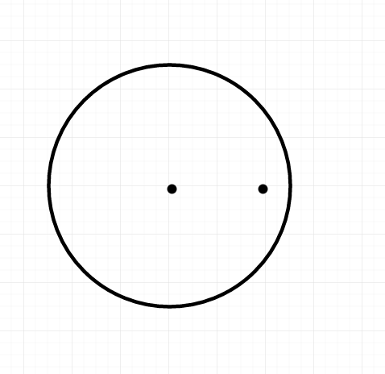

Can we come up with a rule that tells us whether a point is inside a circle? Think about the relationship between the radius of the circle and the distance between the center of the circle and the point. If the distance between the center of the circle and the point is less than the radius of the circle, then that point is inside the circle!

So we know that the first point is outside the circle:

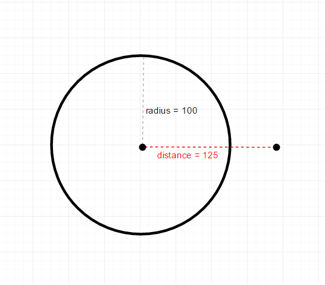

Because the distance between the center of the circle and the point is greater than the radius of the circle. On the other hand, we know that the second point is inside the circle:

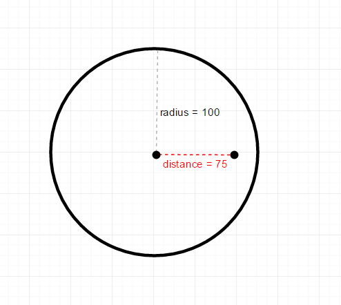

Because the distance between the center of the circle and the point is less than the radius of the circle. Try drawing out a few of your own examples to prove it to yourself!

Putting this into code, we can use the `dist()` function to find the distance between two points. So if our program contains a circle and a point, we can use the `dist()` function and compare it to the radius of the circle to detect whether the point collides with the circle:

```java
float circleCenterX;
float circleCenterY;
float circleRadius;

void setup() {
  size(300, 300);
  circleCenterX = width/2;
  circleCenterY = height/2;
  circleRadius = 100;
}

void draw() {
  background(0);

  if(dist(mouseX, mouseY, circleCenterX, circleCenterY) < circleRadius){
    fill(255, 0, 0);    
  }
  else{
   fill(0, 255, 0);
  }

  ellipse(circleCenterX, circleCenterY, circleRadius*2, circleRadius*2);
}
```

This code stores the position (center) of the circle and its radius in variables. It then uses the `dist()` function to check whether the mouse is inside the circle: if the distance is less than the radius of the circle, then we know that the mouse is inside the circle. If the mouse is inside, it sets the color to red, and if not, it sets the color to green. Finally, the code draws the circle. In other words, this program shows a green circle that turns red when the mouse is inside it.

This technique is useful for creating circular buttons, or for detecting when a point gets close to an object.

## Circle Circle Collision

Now that we know how to detect whether a point is colliding with a circle, we can expand that to detect when a circle collides with another circle. The idea is the same: we still check the distance between the points (the centers of the circles). But instead of checking against the radius of only one circle, we check against the sum of the radiuses of both circles. If the distance between the centers of the circle is less than the sum of the radiuses, then the circles are colliding!

Visualizing it, let's draw out two non-colliding circles, their radiuses, and the distance between their centers:


Notice that the distance between their centers (200) is greater than the sum of their radiuses (175), so we know these circles are not colliding. On the other hand:


In this case, the distance between their centers (150) is less than the sum of their radiuses (175), so we know these circles are colliding. Again, the best thing you can do is draw a bunch of examples yourself to see the pattern.

Putting this into code, we still use the `dist()` function to get the distance between the points, but now we compare it to the sum of the radiuses:

```java
float bigCircleRadius = 50;
float smallCircleRadius = 25;

void setup() {
  size(300, 300);
}

void draw() {
  background(64);

  //draw the big circle
  noFill();
  stroke(255);
  ellipse(width/2, height/2, bigCircleRadius*2, bigCircleRadius*2);

  //change color if circles are colliding
  if(dist(mouseX, mouseY, width/2, height/2) < bigCircleRadius + smallCircleRadius){
    fill(255, 0, 0);    
  }
  else{
   fill(0, 255, 0);
  }

  //draw the small circle
  ellipse(mouseX, mouseY, smallCircleRadius*2, smallCircleRadius*2);

}
```

This code is very similar to the point-circle collision code, except for this line:

```java
if(dist(mouseX, mouseY, width/2, height/2) < bigCircleRadius + smallCircleRadius){
```

This line checks whether the distance between centers of the circles (which are located at the cursor position and the center of the window) is less than the sum of the radiuses of the circle. If this is true, then we've detected a collision between the two circles.

You also aren't limited to using just one kind of collision detection! Try creating a program that shows a ball that bounces off the edges of the screen and also turns red when it's inside a circle at the center of the window!

## Rectangle Point Collision

Unlike circle-point collision, we can't use the distance to detect when a point is inside a rectangle. Instead, we have to check whether the point is between the left and right edges of the rectangle **and** between the top and bottom edges of the rectangle. If that sounds confusing, look at this diagram:

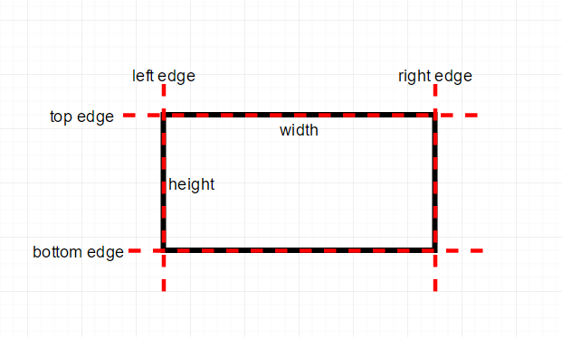

You can think of a rectangle as a top, bottom, left, and right edge. Then using those edges, you can determine whether a point is inside the rectangle by checking whether the point is between the edges. Let's look at a few examples:

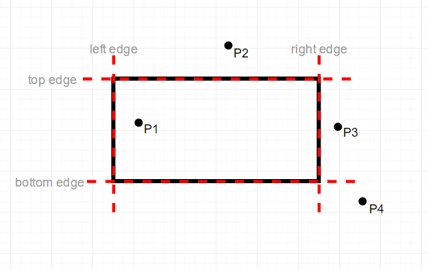

In this code, we can see that point `P1` is inside the rectangle because it's between the left and right edges **and** between the top and bottom edges. Point `P2` is **not** inside the rectangle: even though it's between the left and right edges, it's **not** between the top and bottom edges. Point `P3` is **not** inside the rectangle because even though it's between the top and bottom edges, it's not between the left and right edges. And `P4` is definitely not inside the circle because it's not between any of the edges. Again, the best thing you can do is draw out your own examples to see that the pattern holds!

Putting this into code, if you have the top-left corner of the rectangle at `rectX, rectY`, that means its left edge is at `rectX` and its top edge is at `rectY`. Then if you have the size of the rectangle `rectWidth` by `rectHeight`, you can get its right edge using `rectX + rectWidth` and its bottom edge using `rectY + rectHeight`.

Now that you have the edges, you can check whether a point is inside the rectangle by checking whether it's between the left and right edges **and** between the top and bottom edges. Let's start with checking the left and right edges:

```java
if(pointX > rectX && pointX < rectX + rectWidth){
```

This `if` statement checks whether `pointX` is greater than `rectX` (which checks whether the point is to the right of the left edge) **and** less than `rectX + rectWidth` (which checks whether the point is to the left of the right edge). If either case is not true (if the point is to the left of the left edge or to the right of the right edge), then we know that the point is not inside the rectangle!

Similarly, we can check whether the point is between the top and bottom edges:

```java
if(pointY > rectY && pointY < rectY + rectHeight){
```

This uses the same type of logic to check whether the point is below the top edge **and** above the bottom edge. If either case is not true (if the point is above the top edge or below the bottom edge), then we know that the point is not inside the rectangle!

Now, we have to make sure that both of these `if` statements is true, so we can use a nested `if` statement:

```java
if(pointX > rectX && pointX < rectX + rectWidth){
	if(pointY > rectY && pointY < rectY + rectHeight){
		//the point is inside the rectangle
	}
}
```

Or we could combine it into a single `if` statement:

```java
if(pointX > rectX && pointX < rectX + rectWidth && pointY > rectY && pointY < rectY + rectHeight){
	//the point is inside the rectangle
}
```

Putting it all together, here's an example that detects when the mouse is inside a rectangle:

```java
float rectX;
float rectY;
float rectWidth;
float rectHeight;

void setup() {
  size(300, 300);
  rectX = 50;
  rectY = 100;
  rectWidth = 200;
  rectHeight = 100;
}

void draw() {
  background(64);

  if (mouseX > rectX && mouseX < rectX + rectWidth && mouseY > rectY && mouseY < rectY + rectHeight) {
    fill(255, 0, 0);
  }
  else {
    fill(0, 255, 0);
  }

  rect(rectX, rectY, rectWidth, rectHeight);
}
```

This code uses the above technique to detect when the mouse is inside the rectangle, and change its color to red.

This is useful for things like buttons: you could add another `if` statement that also checks whether the mouse is pressed. If the mouse is pressed **and** the mouse is inside the rectangle, then the user is clicking in the rectangle.

## Rectangle Rectangle Collision Detection

To think about how we detect collision between two rectangles, think about how we would detect that two rectangles are **not** colliding. How do we know that each of the blue rectangles is not overlapping the black rectangle?

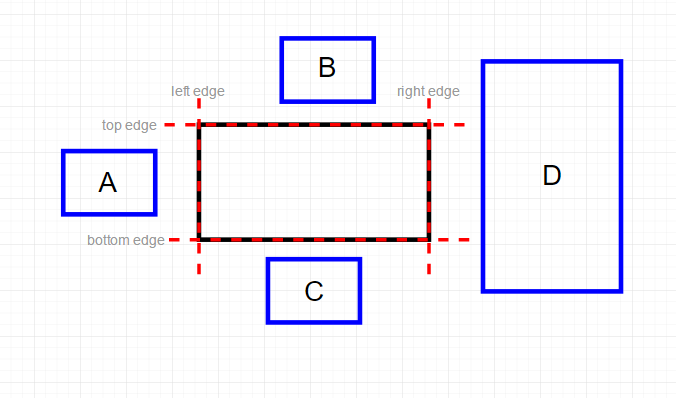

We know that they aren't overlapping because there are gaps between them and the main rectangle. Specifically, we know that `A` is not overlapping the main rectangle because its right edge is to the left of the main rectangle's left edge. We know that `B` is not overlapping the main rectangle because its bottom edge is above the main rectangle's top edge. We know that `C` is not overlapping the main rectangle because its top edge is below the main rectangle's bottom edge. And we know that `D` is not overlapping the main rectangle because its left edge is to the right of the main rectangle's right edge.

Let's say we were going to create an anti-collision-detection algorithm that evaluates to true when two rectangles are **not** colliding. We would put the above cases into code that looks like this:


```java
//evaluates to true if rectOne and rectTwo are NOT colliding
if(rectOneRight < rectTwoLeft || rectOneLeft > rectTwoRight || rectOneBottom < rectTwoTop || rectOneTop > rectTwoBottom){
```

This is just the code version of what we already talked about with the 4 rectangles that do **not** collide with our main rectangle.

Now imagine that we added an `else` block after this `if` statement. Since the `if` statement evaluates to `true` when the rectangles are **not** colliding, then the `else` block would be fired when the rectangles are colliding! Instead of relying on an `else` block, we could reverse the logic in the `if` statement:

```java
//evaluates to true if rectOne and rectTwo are colliding
if(rectOneRight > rectTwoLeft && rectOneLeft < rectTwoRight && rectOneBottom > rectTwoTop && rectOneTop < rectTwoBottom){
```

This `if` statement contains the reverse of the logic in the first `if` statement. Since the first `if` statement detected when the rectangles were **not** colliding, this `if` statement detects when the rectangles **are** colliding.

In other words, this `if` statement checks that all 4 of the edges of the first rectangle are on the other side of the opposidte edge of the second rectangle. That can be confusing, so honestly the best thing to do is to draw out a bunch of example cases with a piece of paper and a pencil. Seriously, I drew about 50 rectangles while writing this tutorial!

Here's an example that shows a center rectangle and a rectangle at the mouse position. If the two rectangles are colliding, the mouse rectangle turns red:

```java
float centerRectX = 125;
float centerRectY = 100;
float centerRectWidth = 50;
float centerRectHeight = 100;

float mouseRectWidth = 100;
float mouseRectHeight = 50;

void setup() {
  size(300, 300);
}

void draw() {
  background(64);

  //draw the center rectangle
  noFill();
  stroke(255);
  rect(centerRectX, centerRectY, centerRectWidth, centerRectHeight);

  //change color if rectangles are colliding
  if (mouseX + mouseRectWidth > centerRectX && mouseX < centerRectX + centerRectWidth && mouseY + mouseRectHeight > centerRectY && mouseY < centerRectY + centerRectHeight) {
    fill(255, 0, 0);
  }
  else {
    fill(0, 255, 0);
  }

  //draw the mouse rectangle
  rect(mouseX, mouseY, mouseRectWidth, mouseRectHeight);
}
```

The meat and potatoes of this code is this `if` statement:

```java
if (mouseX + mouseRectWidth > centerRectX && mouseX < centerRectX + centerRectWidth && mouseY + mouseRectHeight > centerRectY && mouseY < centerRectY + centerRectHeight) {
```

This is the exact same logic we talked through above, using the variables that hold the **state** of our program.

Even if your objects are not actually rectangles, a common technique is to use a rectangle to represent your object anyway. Think of games like Mario or Sonic the Hedgehog- in those types of games, an invisible rectangle (called a [hitbox](https://en.wikipedia.org/wiki/Hitbox)) that surrounds the player is used for collision detection.

## Collision Detection with Moving Objects

Let's say you have two rectangles: one that's drawn in the center of the window, and another that bounces off the edges of the window **and** off the sides of the center rectangle. We know how to bounce the rectangle off the edges of the screen, and we know how to detect when the two rectangles collide, but how do we bounce the rectangle off the center rectangle? For example, a collision might look like this:

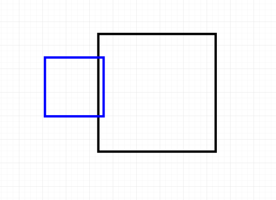

In this case, the bouncing (blue) rectangle is colliding with the center rectangle. But how do we know which way to bounce? As humans we can look at this image and know that the blue rectangle should bounce to the left, but remember that our code only has a yes-or-no check for collision: it doesn't know which side is being hit, so it has no way to know which way to bounce!

To fix this, we can check where the bouncing rectangle **will be** instead of where it already is. This allows us to check collision in the X and Y directions separately. That might sound complicated, but the general algorithm would look like this:

- If I keep moving in my current X direction, will I collide with the center rectangle? If so, reverse my X direction.
- If I keep moving in my curent Y direction, will I collide with the center rectangle? If so, reverse my Y direction.

Putting this into code, we would do this by using the rectangle-rectangle collision detection twice: first using the location that the rectangle will be if it keeps going in the X direction (which we get by adding the X speed to the X position), and again using the location that the rectangle will be if it keeps going in the Y direction (which we get by adding the Y speed to the Y position).

```java
float centerRectX = 125;
float centerRectY = 100;
float centerRectWidth = 50;
float centerRectHeight = 100;

float bouncingRectX = 10;
float bouncingRectY = 10;
float bouncingRectWidth = 100;
float bouncingRectHeight = 50;
float bouncingRectSpeedX = 1;
float bouncingRectSpeedY = 2;

void setup() {
  size(300, 300);
  noFill();
}

void draw() {
  background(64);

  //draw the center rectangle
  stroke(255);
  rect(centerRectX, centerRectY, centerRectWidth, centerRectHeight);

  //if I keep moving in my current X direction, will I collide with the center rectangle?
  if (bouncingRectX + bouncingRectWidth + bouncingRectSpeedX > centerRectX &&
      bouncingRectX + bouncingRectSpeedX < centerRectX + centerRectWidth &&
      bouncingRectY + bouncingRectHeight > centerRectY &&
      bouncingRectY < centerRectY + centerRectHeight) {
    bouncingRectSpeedX *= -1;
  }
  //bounce off left and right edges of screen
  else if(bouncingRectX < 0 || bouncingRectX + bouncingRectWidth > width){
    bouncingRectSpeedX *= -1;
  }

  //if I keep moving in my current Y direction, will I collide with the center rectangle?
  if (bouncingRectX + bouncingRectWidth > centerRectX &&
      bouncingRectX < centerRectX + centerRectWidth &&
      bouncingRectY + bouncingRectHeight + bouncingRectSpeedY > centerRectY &&
      bouncingRectY + bouncingRectSpeedY < centerRectY + centerRectHeight) {
    bouncingRectSpeedY *= -1;
  }
  //bounce off top and bottom edges of screen
  else if(bouncingRectY < 0 || bouncingRectY + bouncingRectHeight > height){
    bouncingRectSpeedY *= -1;
  }

  bouncingRectX += bouncingRectSpeedX;
  bouncingRectY += bouncingRectSpeedY;

  //draw the bouncing rectangle
  rect(bouncingRectX, bouncingRectY, bouncingRectWidth, bouncingRectHeight);
}
```

Let's take a closer look at this `if` statement:

```java
  //if I keep moving in my current X direction, will I collide with the center rectangle?
  if (bouncingRectX + bouncingRectWidth + bouncingRectSpeedX > centerRectX &&
      bouncingRectX + bouncingRectSpeedX < centerRectX + centerRectWidth &&
      bouncingRectY + bouncingRectHeight > centerRectY &&
      bouncingRectY < centerRectY + centerRectHeight) {
    bouncingRectSpeedX *= -1;
  }
```

This might look confusing, but this is the exact same rectangle-rectangle collision detection `if` statement we've already used. The only difference is that it's adding `bouncingRectSpeedX` to the X position, so that it's checking the position it's about to move to, not its current position. We could rewrite this `if` statement using variables:

```java
  float currentBouncingLeft = bouncingRectX;
  float currentBouncingRight = bouncingRectX + bouncingRectWidth;
  float currentBouncingTop = bouncingRectY;
  float currentBouncingBottom = bouncingRectY + bouncingRectHeight;

  float nextBouncingLeft = currentBouncingLeft + bouncingRectSpeedX;
  float nextBouncingRight = currentBouncingRight + bouncingRectSpeedX;

  //if I keep moving in my current X direction, will I collide with the center rectangle?
  if (nextBouncingRight > centerRectX &&
      nextBouncingLeft < centerRectX + centerRectWidth &&
      currentBouncingBottom > centerRectY &&
      currentBouncingTop < centerRectY + centerRectHeight) {
    bouncingRectSpeedX *= -1;
  }
```

This is still the exact same logic, just using variables to make what it's doing a little more obvious. Now we can see that we're still just checking whether the edges overlap. The only difference is that we're using where the edges will be. Also notice that we're only checking the next position of the left and right edges, and we're assuming that the top and bottom edges will stay at the same position. This allows us to check the top and bottom edges separately in the next `if` statement, which allows us to know which direction to bounce!

## Snapping to an Edge

Picture a [platforming game](https://en.wikipedia.org/wiki/Platform_game) like Mario or Sonic the Hedgehog, where the player can walk along the ground. Now, imagine the player jumps, leaves the ground, and then comes back down. We can use edge collision detection or rectangle-rectangle collision detection to know when the player hits the ground, and we can simply set their Y speed to `0` to stop them falling. The problem is, our player will still be in their current position when we stop them. In other words, the player will stil be a little bit "inside" the ground:

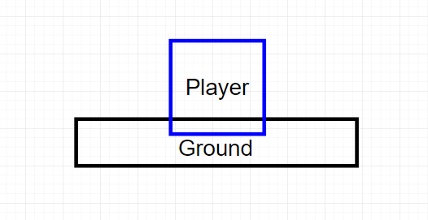

We could use the moving objects logic where we check collision using the next position, but we'd hit a similar problem with the player floating a few pixels above the ground. What we want is for the player to "snap" to the ground's position:

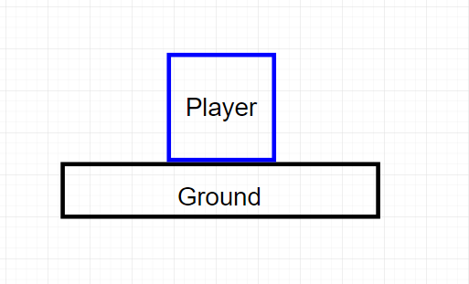

In other words, we want the position of the bottom of the player to equal the position of the top of the ground. And since our player's position is usually stored as its top Y value and a height, that means we want the position of the top of our player to equal the ground's top minus the player's height.

Putting it into code, it looks like this:

```python
import pygame
   
def main():
    #-----------------------------Setup------------------------------------------------#
    """ Set up the game and run the main game loop """
    pygame.init()      # Prepare the pygame module for use
    surfaceSize = 480   # Desired physical surface size, in pixels.

    clock = pygame.time.Clock()  #Force frame rate to be slower

    # Create surface of (width, height), and its window.
    mainSurface = pygame.display.set_mode((surfaceSize, surfaceSize))

    #-----------------------------Program Variable Initialization----------------------#

    # Create the the size, position and color for a circle
    circlePosX  = 200
    circlePosY = 200
    circleSize = 30
    circleColor = (255,0,0)
    circleSpeedY = 0;
    jumping = False
    
    groundLevel = 400
    
    

   #-----------------------------Main Game Loop----------------------------------------#
    while True:
        #-----------------------------Event Handling-----------------------------------#
        ev = pygame.event.poll()    # Look for any event
        if ev.type == pygame.QUIT:  # Window close button clicked?
            break                   #   ... leave game loop
        if ev.type == pygame.MOUSEBUTTONUP:
            #You can only jump if you are not already jumping
            if (not jumping):
                #Going up
                circleSpeedY = -20
                
                #Disallow jumping since already in the air
                jumping = True
 
        #-----------------------------Game Logic---------------------------------------#
       
        #Move the circle
        circlePosY += circleSpeedY
        
        #Is the player colliding with the ground?
        if ((circlePosY + circleSize) > groundLevel):
            #Snap the player's bottom to the ground
            circlePosY = groundLevel - circleSize
            
            #Stop the circle falling
            circleSpeedY = 0
            
            #Allow jumping
            jumping = False
        
        #The circle is not colliding with the ground
        else:
            #Gravity acclerates the movement speed
            circleSpeedY += 1
        
        #-----------------------------Drawing Everything-------------------------------#
        # So fill everything with the background color
        mainSurface.fill((0, 200, 255))
      
        #Draw the ground
        pygame.draw.rect(mainSurface,(200,200,200), (0,groundLevel,surfaceSize,surfaceSize-groundLevel))
        #Draw the Circle
        pygame.draw.circle(mainSurface, circleColor, (circlePosX,circlePosY), circleSize)         
        # Now the surface is ready, tell pygame to display it!
        pygame.display.flip()
        
        clock.tick(60) #Force frame rate to be slower

    pygame.quit()     # Once we leave the loop, close the window.

main()
```

This code stores the state of the player and the ground in variables. It updates the player's position and checks whether the player is colliding with the ground using edge collision detection, but note that this could have also been rectangle-rectangle collision detection. It doesn't really matter how the collision is detected. But when there is a collision, the player's position is updated so they rest on the ground, and then `playerSpeedY` is set to `0` so the player stops falling. This code also uses a `jumping` variable to prevent the player from jumping again while they're already jumping. If there isn't a collision, that means the player is in the air. In this case, the `playerSpeedY` variable is increased, which causes the player to accelerate downward, similar to how gravity causes things to accelerate towards the ground. Finally, the `keyPressed()` function changes the `playerSpeedY` variable to cause the player to move upwards when a key is pressed.

This example uses edge collision detection and only checks against a single edge just to keep things simple, but note that you can use any form of collision detection with this "snap to edge" approach, and you can do it on any side. Think of a rectangle that you can move with the arrow keys, and another rectangle in the center. You could detect when your rectangle is about to collide with the center rectangle, and snap its position to the appropriate side.

## Collision Detection between Many Objects

So far, all of our examples have handled collision detection for only one or two objects. But you can take these techniques and apply them to many objects using this general approach:

- Encapsulate the data that represents an object in a class. For example the class might hold a position and size.
- Create instances of this class so each instance represents one object in your scene. Store these instances in a data structure like an array or an `ArrayList`.
- Use a loop to iterate over that data structure.
- For each instance, do the collision detection against that instance.

Here's an example that uses that approach to show a rectangle that bounces off eight different obstacles:

```java
ArrayList<Rectangle> rectangles = new ArrayList<Rectangle>();

float bouncingRectX = 150;
float bouncingRectY = 150;
float bouncingRectWidth = 20;
float bouncingRectHeight = 20;
float bouncingRectSpeedX = 2;
float bouncingRectSpeedY = 1;

void setup() {
  size(300, 300);

  rectangles.add(new Rectangle(0, 0, width, 20));
  rectangles.add(new Rectangle(0, width-20, width, 20));
  rectangles.add(new Rectangle(0, 0, 20, height));
  rectangles.add(new Rectangle(width-20, 0, 20, height));
  rectangles.add(new Rectangle(100, 100, 20, 20));
  rectangles.add(new Rectangle(200, 100, 20, 20));
  rectangles.add(new Rectangle(200, 200, 20, 20));
  rectangles.add(new Rectangle(100, 200, 20, 20));
}

void draw() {
  background(64);

  //iterate over the obstacles
  for (int i = 0; i < rectangles.size(); i++) {

    //check collision for this obstacle
    Rectangle rectangle = rectangles.get(i);

    //check X movment bounce
    if (bouncingRectX + bouncingRectWidth + bouncingRectSpeedX > rectangle.x &&
      bouncingRectX + bouncingRectSpeedX < rectangle.x + rectangle.rectWidth &&
      bouncingRectY + bouncingRectHeight > rectangle.y &&
      bouncingRectY < rectangle.y + rectangle.rectHeight) {

      bouncingRectSpeedX *= -1;
    }

    //check Y movement bounce
    if (bouncingRectX + bouncingRectWidth> rectangle.x &&
      bouncingRectX< rectangle.x + rectangle.rectWidth &&
      bouncingRectY + bouncingRectHeight + bouncingRectSpeedY > rectangle.y &&
      bouncingRectY + bouncingRectSpeedY < rectangle.y + rectangle.rectHeight) {

      bouncingRectSpeedY *= -1;
    }

    //draw the obstacle rectangle
    fill(255, 0, 0);
    rect(rectangle.x, rectangle.y, rectangle.rectWidth, rectangle.rectHeight);
  }

  bouncingRectX += bouncingRectSpeedX;
  bouncingRectY += bouncingRectSpeedY;

  //draw the bouncing rectangle
  fill(0, 255, 0);
  rect(bouncingRectX, bouncingRectY, bouncingRectWidth, bouncingRectHeight);
}

class Rectangle {
  float x;
  float y;
  float rectWidth;
  float rectHeight;

  public Rectangle(float x, float y, float rectWidth, float rectHeight) {
    this.x = x;
    this.y = y;
    this.rectWidth = rectWidth;
    this.rectHeight = rectHeight;
  }
}

```

This code defines variables that represent a bouncing rectangle, and it also contains a `Rectangle` class that represents an obstacle. Eight instances of that class are created and stored in an `ArrayList`, and the `draw()` function contains code that iterates over each of those instances. For each instance, the code checks for collision between the bouncing rectangle and the obstacle rectangle, using the approach we talked about before to determine which way to bounce if a collision is detected.

Note that even though we have 8 different obstacles, we use the same collision detection logic for all 8 of them, so we don't have to write the same code over and over again. Adding more obstacles would be as simple as adding a new instance of `Rectangle` to the `ArrayList`. Try making it so a new obstacle is added when the user clicks the mouse!

Again, you can use any type of collision detection with this approach. The point is that you can use classes to encapsulate data and behaviors (variables and functions), add instances of that class to a data structure, and then iterate over that data structure to do collision detection against each object. This makes it easier to do collision detection with multiple objects.

## Grid-Based Collision Detection

The above examples used various shapes to represent objects, and used those shapes to do collision detection. Another approach is to use a grid that contains information about where obstacles are.

Think about it this way: imagine a piece of graph paper that starts out as a bunch of blank cells.

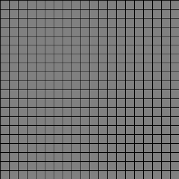

Now imagine that you fill some of those cells in.

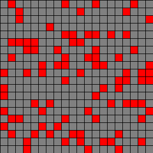

These red filled-in cells are obstacles. Now add a player to one of the cells.

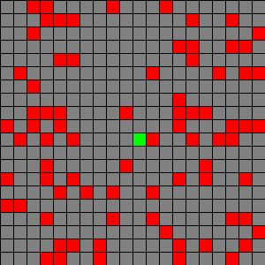

The player is the green cell. In the grid, the player can either move up, down, left, or right by one cell. But in this case, the player can't move right because an obstacle is blocking their way.

Putting this into code, we could represent the grid using a 2D `boolean` array. We treat each cell in the array just like a cell in our graph paper. If the cell is `true`, then it's an obstacle. Then we represent the player's position as an X and Y index in that grid, and we check that position against the obstacles in the grid. Whenever the player tries to move, we first check whether it's about to collide with an obstacle in the grid.

```java
//build a grid
int rows = 20;
int columns = 20;
//if a cell is true it's an obstacle
boolean[][] grid = new boolean[rows][columns];

//where the player is in the grid
int playerIndexX = 10;
int playerIndexY = 10;

void setup() {
  size(300, 300);

  //randomly place obstacles in the grid
  for (int row = 0; row < grid.length; row++) {
    for (int column = 0; column < grid[row].length; column++) {
      //each cell has a 20% chance of being an obstacle
      if (random(1) < .2) {
        grid[row][column] = true;
      }
    }
  }
}

void draw() {
  background(128);

  float cellWidth = width/columns;
  float cellHeight = height/rows;

  for (int row = 0; row < rows; row++) {
    for (int column = 0; column < columns; column++) {

      float cellX = cellWidth*column;
      float cellY = cellHeight*row;

      //fill the obstacles in with red
      if (grid[row][column]) {
        fill(255, 0, 0);
      }
      else {
        noFill();
      }

      rect(cellX, cellY, cellWidth, cellHeight);
    }
  }

  //fill the player's cell with green
  float playerPixelX = playerIndexX * cellWidth;
  float playerPixelY = playerIndexY * cellHeight;
  fill(0, 255, 0);
  rect(playerPixelX, playerPixelY, cellWidth, cellHeight);
}

void keyPressed() {
  if (keyCode == UP) {
    //if we aren't in the top row and the cell above us doesn't contain an obstacle
    //then we can move up
    if (playerIndexY > 0 && !grid[playerIndexY-1][playerIndexX]) {
      playerIndexY--;
    }
  }
  else if (keyCode == DOWN) {
    //if we aren't in the bottom row and the cell below us doesn't contain an obstacle
    //then we can move down
    if (playerIndexY < rows-1 && !grid[playerIndexY+1][playerIndexX]) {
      playerIndexY++;
    }
  }
  else if (keyCode == LEFT) {
    //if we aren't in the left-most column and the cell to our left doesn't contain an obstacle
    //then we can move left
    if (playerIndexX > 0 && !grid[playerIndexY][playerIndexX-1]) {
      playerIndexX--;
    }
  }
  else if (keyCode == RIGHT) {
    //if we aren't in the right-most column and the cell to our right doesn't contain an obstacle
    //then we can move right
    if (playerIndexX < columns-1 && !grid[playerIndexY][playerIndexX+1]) {
      playerIndexX++;
    }
  }
}
```

This code creates a grid and randomly adds obstacles to it. It also keeps track of the player's position, and if the user tries to move the player, the code first checks if there's an obstacle in the cell before changing the player's position.

This approach is used for things like mazes, or map-based interfaces, or games like Tetris or Pokemon.

You can even use a hybrid approach where you store your obstacles in a grid, but your player's position in terms of pixels. Then to check whether the player is colliding with an obstacle, you convert the pixel position into a grid cell. This is how games like the original Super Mario Brothers worked.

Also note that you can use more complicated data types than `boolean` values. For example, each grid cell could contain an `int` that represents the type of terrain in that cell: `0` for grass, `1` for water, `2` for forest, etc. Or each grid cell could contain an object (or even multiple objects) that represent exactly what's in that cell. The point is, you aren't limited to just `boolean` values!

### More Advanced Collision Detection

This tutorial can't possibly cover every possible collision detection algorithm. But hopefully this gives you some familiarity with the general approach of representing your objects as variables, using various techniques to determine whether those objects are intersecting, and taking some action if they are.

We've used points, rectangles, and circles, but you can use any shape you want. You just have to find the right math. So don't be afraid to do a Google search of stuff like "rectangle line intersection", which will lead you to a mathematical formula that you can then turn into code.

There are also tricks you can do to cut down on the number of collision checks you have to do. I mentioned the hybrid approach of using a grid to represent obstacles and converting the player's pixel position into grid cells, but there are other location-based data structures like [R-trees](https://en.wikipedia.org/wiki/R-tree) and [Quadtrees](https://en.wikipedia.org/wiki/Quadtree) that help organize your objects in a way that avoids doing unnecessary collision checks. (Think about it this way: if you know your player is on the left side of the screen, you probably don't need to check for collision against objects on the right side of the screen.)

Another way to approach collision detection is to use a hybrid algorithm- for example, first do a distance-based check, which can be done very fast and with little code. If that check is true, then spend more time doing something like hit box detection. If that is true, then you can do more specific or even pixel-perfect collision detection. This avoids extra work, but gives you the maximum amount of precision.

There are also entire libraries and frameworks devoted to collision detection and even accurate physics simulations!

Which method you use will depend on your application. Most applications don't need very complicated collision detection, whereas other applications require realistic physics and pixel-perfect accuracy. There is no single correct approach, and most "real" applications will use a mix of several approaches.

Like I said, this tutorial isn't meant to teach you everything there is to know about collision detection. It was designed to give you a familiarity with the basic concepts, that way you can go off and do your own research to figure out which approach is best for you.

## Homework

- Create a maze application. Try basing it off a map of your town. What would the obstacles be?
- Create an animation that shows 100 randomly placed obstacles, and 100 random rectangles that bounce off of them. When a bouncer hits an obstacle, change their color.
# Credits
Thanks to Kevin Workman of [Happy Coding](https://happycoding.io/tutorials/processing/) for the original source material for this note.
